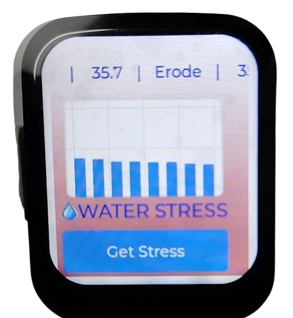
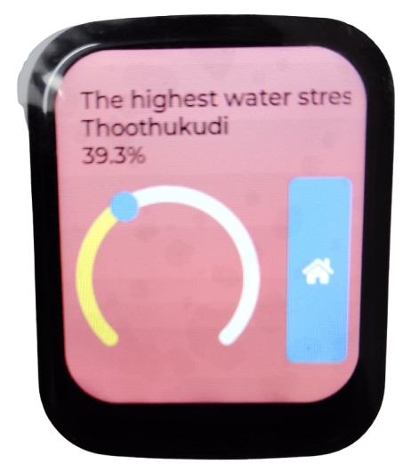
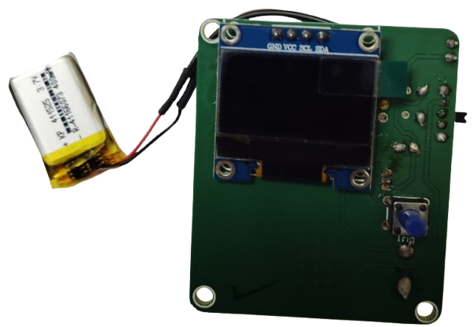
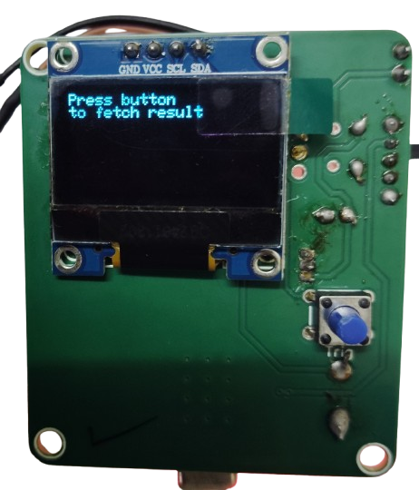
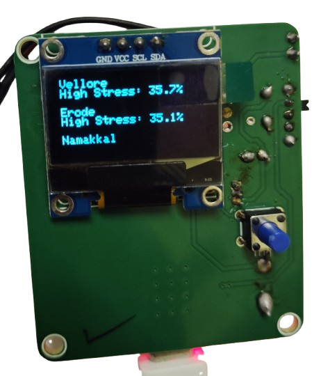
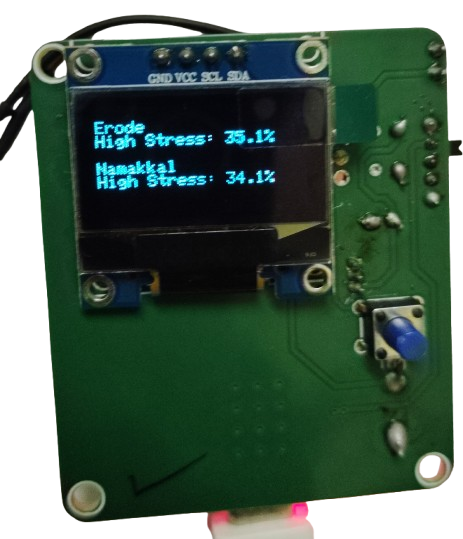

# 🌱 District Level Water Stress Monitor using Satellite Data – Edge Visualization

[](https://www.waveshare.com/wiki/ESP32-C6-Touch-LCD-1.69)
[](https://www.arduino.cc/)
[](https://lvgl.io/)
[](LICENSE)
[](https://render.com)

<div align="center">

  <table>
    <tr>
      <td align="center">
        
        <br>
        <em>ESP32-C6 dashboard showing district-level water stress</em>
      </td>
      <td align="center">
        
        <br>
        <em>Tamil Nadu district-wise water stress visualization</em>
      </td>
    </tr>
  </table>

</div>
---

## 📌 Overview

This project is the **edge visualization component** of a larger framework that:

1. Processes Sentinel-1 SAR data in Google Earth Engine
2. Computes a baseline-normalized **Moisture Stress Index (Z-score)**
3. Serves district-level metrics via a REST API
4. Displays them on this ESP32-based device

**Use Case:** Agricultural drought monitoring for farmers, extension officers, and local administrators in off-grid or low-internet settings.

---

## 🖥️ Hardware Requirements

| Component | Specification |
|-----------|---------------|
| **Board** | Waveshare ESP32-C6-Touch-LCD-1.69 |
| **Display** | 1.69" 240×280 ST7789 (touch-capacitive) |
| **Alternative Display** | OLED (128×64, I2C) for low-power deployments |
| **Connectivity** | Wi-Fi 6 (2.4 GHz) |
| **Power** | USB-C or 3.7V Li-ion battery |

---

## 🖼️ Display Interface Gallery

### Waveshare LCD Touch Display (Primary)

| Main Dashboard | High Stress Analysis View |
|:---:|:---:|
|  |  |
| *District-wise stress Scroll with Chart* | *Highest stress district with animated arc gauge* |

**Features:**
- ✅ Full color 262K display
- ✅ Capacitive touch navigation
- ✅ Swipe left to access high-stress view
- ✅ Home button for quick return
- ✅ Animated arc gauge for stress visualization

---

### OLED Display Alternative (Low-Power Option)

For battery-critical deployments, a simple OLED display can be used as a low-power alternative.

| Initial State | Press Button | Result Display 1 | Result Display 2 |
|:---:|:---:|:---:|:---:|
|  |  |  |  |
| *Awaiting data* | *Fetching from API* | *District: Stress Scrolling* | *Stress: 39.26%* |

**OLED Features:**
- ✅ Ultra-low power consumption (~10mA active, ~0.5mA sleep)
- ✅ Simple numeric readout
- ✅ I2C interface (minimal wiring)
- ✅ Best for remote/solar-powered deployments

---

### Display Comparison Table

| Feature | Waveshare LCD | OLED |
|---------|---------------|------|
| **Size** | 1.69" | 0.96" - 1.3" |
| **Resolution** | 240×280 | 128×64 |
| **Color** | 262K colors | Monochrome |
| **Touch Screen** | ✅ Capacitive | ❌ |
| **GUI Complexity** | Rich (charts, arcs, images) | Simple (text, basic shapes) |
| **Power (Active)** | ~40-60 mA | ~10-15 mA |
| **Power (Sleep)** | ~5 mA | ~0.5 mA |
| **Best For** | Full-featured stations | Battery-critical remote deployment |

---

## 📦 Features

- ✅ Fetches **district-wise stress** data from cloud API
- ✅ Displays **mean stress**, **max stress**, and **high-stress percentage**
- ✅ Visualizes historical trends with **bar chart** (Waveshare only)
- ✅ Shows **highest stress district** with animated arc gauge
- ✅ **Power management** – deep sleep, wake on PWR button
- ✅ Touch navigation – swipe left for detailed view, home button to return
- ✅ Offline-capable – retains last fetched data
- ✅ **Dual display support** – Works with both Waveshare LCD and OLED

---

## 🚀 Getting Started

Follow these steps in order to set up the complete system from satellite processing to edge device visualization.

---

### Phase 1: Cloud Infrastructure Setup

#### 1.1 Google Earth Engine (GEE) – SAR Processing

1. Go to [Google Earth Engine Code Editor](https://code.earthengine.google.com/)
2. Copy the provided GEE script into a new file
3. Set your analysis years (baseline: 2021–2025, current: 2026)
4. Run the script and verify the district-level stress table output
5. Export the results as CSV/GeoJSON when satisfied

#### 1.2 Create GEE Service Account (for API access)

| Step | Action |
|------|--------|
| 1 | Go to [Google Cloud Console](https://console.cloud.google.com/) |
| 2 | Enable **Earth Engine API** for your project |
| 3 | Create a **Service Account** with Earth Engine access |
| 4 | Generate a **private key** in JSON format – download and save securely |
| 5 | Note your **Project ID** and **Service Account email** |

#### 1.3 Deploy Cloud API (Render.com or similar)

**Required environment variables** in your hosting platform:

```env
GEE_SERVICE_ACCOUNT=your-service-account@project.iam.gserviceaccount.com
GEE_PRIVATE_KEY_JSON={"type":"service_account","project_id":"..."}
GEE_PROJECT_ID=your-project-id

Edit the following lines in the Arduino code:

```cpp
const char* WIFI_SSID = "Your_SSID";
const char* WIFI_PASS = "Your_Password";
const char* STRESS_URL = "https://your-api.com/stress-compact";
